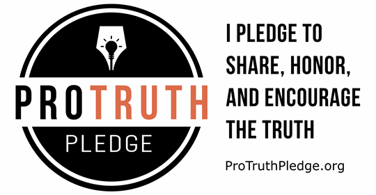
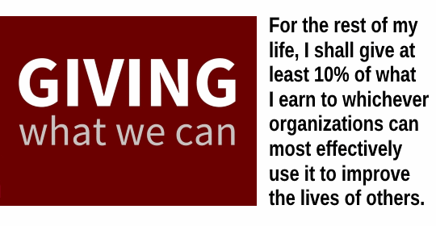

### My open source work ###

- [Loyc](http://loyc.net): a collection of ideas and projects for programming language interoperability standards, including [Loyc trees](http://loyc.net/loyc-trees) and [LES](http://loyc.net/les).
- [Loyc Core Libraries](http://core.loyc.net): general-purpose C# libraries with the theme of "things that should be built into the .NET framework, but aren’t". See also: [Doxygen reference](http://ecsharp.net/doc/code/).
- [LLLPG](http://ecsharp.net/lllpg/): a parser generator for C# that generates efficient code and integrates with Visual Studio.
- [LeMP](http://ecsharp.net/lemp/): a language-agnostic Lisp-style macro processor that allows you to run arbitrary code at compile time. Currently implemented only for C#.
- [Enhanced C#](http://ecsharp.net) (EC#): a superset of C# used by LeMP.
- [Ungglish](http://ungglish.loyc.net): an incomplete idea for an alternative to English as a second language.

### My writing ###

- [Technical blog](http://loyc.net/blog)
- [Technical articles on CodeProject](https://www.codeproject.com/script/Articles/MemberArticles.aspx?amid=3453924) on various topics
- [Typescript & React primer](http://typescript-react-primer.loyc.net)
- [Big Picture](https://medium.com/big-picture) (general topics)

### Other stuff ###

- [GitHub profile](https://github.com/qwertie/)
- [LinkedIn profile](https://www.linkedin.com/in/qwertie/)

### Contact ###

You can reach me via email at gmail.com; my username there is qwertie256.

